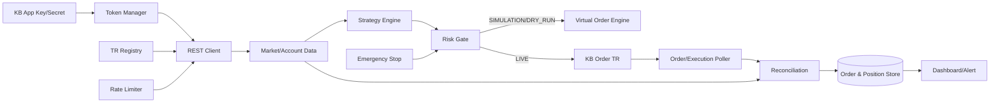
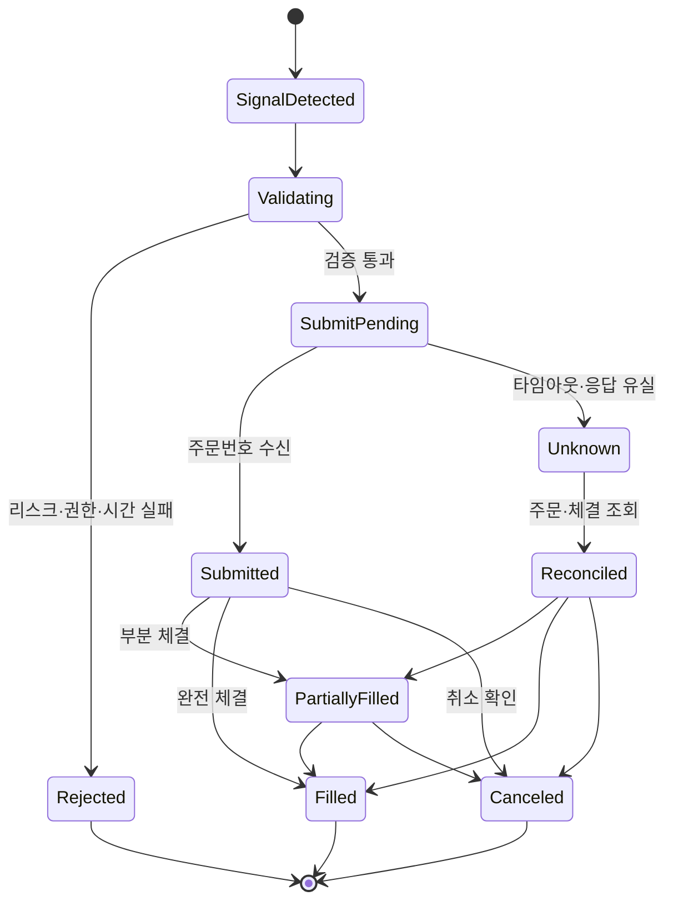
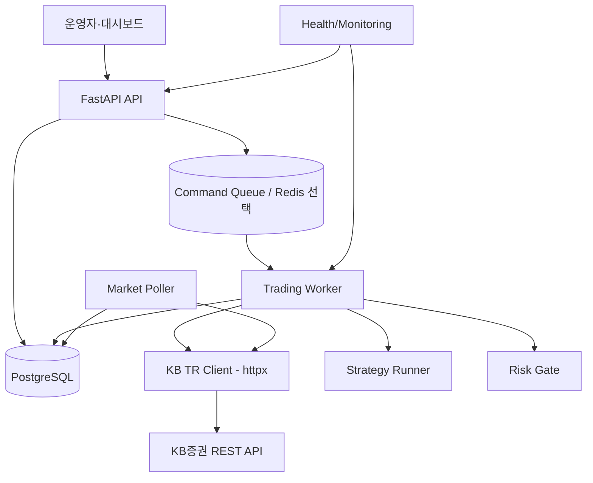

# KB증권 주식 자동매매 시스템 PRD

## 1. 문서 정보

- 문서 버전: 0.1
- 작성일: 2026-09-21
- 상태: 초안
- 대상 서비스: KB증권 B2C Open API
- 공식 API 문서: [KB증권 API 문서](https://openapi.kbsec.com/apidoc_b2c)
- 개발 가이드: [KB증권 Open API 개발가이드](https://openapi.kbsec.com/guide_b2c)
- 운영 Base URL: `https://developer.kbsec.com:32484`

이 문서는 KB증권 Open API를 사용해 계좌·잔고·시세를 조회하고, 전략 신호에 따라 주식 주문을 자동으로 실행·추적하는 시스템의 요구사항을 정의한다. KB증권 문서는 API를 통합 리소스 이름보다 `TR_CODE` 중심으로 제공하므로, 구현 전에 포털에서 내려받은 최신 JSON V2 또는 Excel 명세를 기준으로 각 기능의 TR_CODE와 필드를 확정한다.

## 2. 문서 분석 요약

KB증권 Open API 포털에서 확인한 구조는 다음과 같다.

- KB증권 계좌와 Open API 서비스 사용신청이 필요하다.
- `appKey`와 `appSecret`으로 OAuth 2.0 Client Credentials 방식의 Access Token을 발급한다.
- API 호출은 HTTPS·JSON 형식이며 `Authorization: Bearer {access_token}` 헤더를 사용한다.
- 운영 환경 URL은 `https://developer.kbsec.com:32484`로 안내되어 있다.
- API 요청은 `/api/v1/{TR_CODE}` 형태이며 `dataHeader`, `dataBody` 구조의 예시가 제공된다.
- 서비스는 시세·종목·계좌·잔고 조회, 주문·체결 연동, 자동화 서비스를 대상으로 한다.
- 현재 B2C Open API는 베타 서비스로 운영되고 있으며 제공 API, 이용 가능 시간, 호출 한도, 계좌 조건이 변경될 수 있다.
- 포털 공지상 WebSocket 실시간 정보 서비스는 개발 중이므로 1차 시스템은 REST 폴링과 주문·체결 조회를 기본으로 설계한다.
- 정확한 TR_CODE, 요청 필드, 응답 필드, 오류 코드와 API별 호출 제한은 포털의 최신 API JSON V2/Excel 명세를 구현 기준으로 삼는다.

## 3. 제품 요약

사용자가 정의한 전략을 시장 시간에 맞춰 실행하고, KB증권 REST API에서 받은 시세·잔고·체결 정보를 바탕으로 주문을 생성하고 상태를 관리하는 자동매매 시스템이다.

초기 제품은 국내 주식의 주기적 시세 조회와 지정가·시장가 주문을 대상으로 한다. 해외주식 또는 실시간 WebSocket은 포털의 최신 API 목록과 계좌 권한이 확인된 뒤 별도 어댑터로 확장한다.

## 4. 목표와 성공 기준

### 4.1 목표

- KB증권 인증과 계좌 권한을 안전하게 관리한다.
- TR_CODE별 API 차이를 내부 표준 모델로 정규화한다.
- 시세 수집, 전략 계산, 리스크 검증, 주문, 체결 확인을 분리한다.
- API 오류·응답 지연·호출 제한·프로세스 재시작 이후에도 계좌 상태를 복구한다.
- 실주문 이전에 동일 로직으로 시뮬레이션과 드라이런을 수행한다.
- 모든 주문 의사결정과 API 응답을 추적 가능하게 만든다.

### 4.2 성공 기준

- 최신 KB API 명세에서 등록한 TR_CODE로 인증·조회·주문·체결 확인의 최소 수직 흐름이 동작한다.
- 시뮬레이션 모드에서는 외부 주문 TR을 호출하지 않고도 전략 신호와 주문 상태 전이를 재현한다.
- 주문 요청의 응답이 유실되어도 주문번호·체결내역 확인 후 중복 주문 여부를 판단한다.
- 호출 제한 초과 시 요청을 자동으로 늦추고 같은 초에 무제한 재시도하지 않는다.
- 실주문 모드는 기본 비활성이고, 운영자가 명시적으로 활성화한 계좌와 전략에서만 동작한다.

## 5. 범위

### 5.1 1차 범위

- KB증권 Open API 사용신청 및 인증 설정 안내
- `appKey`·`appSecret` 기반 Access Token 발급과 만료 관리
- TR 명세 레지스트리와 요청·응답 JSON 검증
- 국내 주식 종목·현재가·호가·차트·체결 정보 조회
- 계좌 예수금·보유잔고·매수 가능 금액·매도 가능 수량 조회
- 국내 주식 매수·매도 주문
- 미체결·체결내역·주문 상태 조회
- 주문 정정·취소가 제공되는 TR의 연동
- REST 기반 주기 수집 스케줄러와 중앙 호출 제한기
- 시뮬레이션·드라이런·실주문 모드
- 리스크 제한, 긴급 중지, 감사 로그

### 5.2 2차 범위

- 포털 명세에서 확인된 해외주식 API
- KB증권 WebSocket 출시 후 실시간 시세·체결 어댑터
- 복수 전략과 복수 계좌 운영
- 웹 대시보드, 체결·오류 알림, 성과 리포트
- 백테스트와 전략 파라미터 관리

### 5.3 제외 범위

- KB증권 계좌 개설과 본인 인증 자동화
- API 문서에 없는 모의투자 서버를 임의로 가정한 실거래 연동
- 투자 자문·종목 추천·수익 보장 기능
- 신용·파생·채권·ISA·연금 상품의 자동매매
- TR 명세 확인 전 해외주식 또는 실시간 데이터 지원을 확정하는 것

## 6. 사용자와 사용 시나리오

### 주요 사용자

- 개인 투자자: KB증권 계좌에 연결한 전략을 실행하고 상태를 확인한다.
- 개발·운영 담당자: TR 명세, API 오류, 주문 상태와 호출량을 점검한다.

### 대표 시나리오

1. 사용자가 KB증권 계좌를 만들고 Open API 서비스 사용신청을 완료한다.
2. 시스템에 App Key와 Secret Key를 안전하게 등록한다.
3. 시스템이 Access Token을 발급하고 계좌 접근 권한을 검증한다.
4. 운영자가 최신 JSON V2/Excel에서 필요한 TR_CODE를 등록한다.
5. 시스템이 시장 시간과 종목 상태를 확인하면서 시세를 주기적으로 수집한다.
6. 전략 엔진이 신호를 생성하면 주문 전 잔고·금액·가격·호출 한도를 검증한다.
7. 주문 TR을 한 번 호출하고 주문번호를 저장한다.
8. 체결·미체결 조회 TR로 주문 상태를 확인해 내부 포지션을 갱신한다.
9. 오류나 재시작 이후 미체결·당일 체결내역을 재조회해 내부 상태를 복구한다.

## 7. KB API 연동 기준

### 7.1 인증

토큰 요청은 다음 형식을 기준으로 구현한다. 필드명·대소문자는 KB 포털의 최신 샘플과 실제 명세를 우선한다.

```http
POST https://developer.kbsec.com:32484/oauth2/token
Content-Type: application/json
```

```json
{
  "grant_type": "client_credentials",
  "appKey": "${KB_APP_KEY}",
  "appSecret": "${KB_APP_SECRET}"
}
```

예시 응답은 `access_token`, `token_type: Bearer`, `expires_in: 86400` 구조다. 토큰 발급 시 앱 키 유효성, 서비스 신청 여부, 앱 상태, API·계좌 권한, 호출 제한 정책이 함께 검증될 수 있다.

### 7.2 공통 호출

```http
POST https://developer.kbsec.com:32484/api/v1/{TR_CODE}
Content-Type: application/json
Authorization: Bearer ${ACCESS_TOKEN}
```

KB 가이드에는 다음과 같은 요청 구조 예시가 있다.

```json
{
  "dataHeader": {
    "ipAddr": "127.0.0.1",
    "macAddr": "1A-2B-3C-4D-5E-67"
  },
  "dataBody": {
    "...": "TR별 요청 필드"
  }
}
```

`ipAddr`, `macAddr`를 포함한 실제 필수 헤더와 필드명은 TR별 최신 명세에서 확인한다. 예시를 모든 API의 공통 필수 필드로 하드코딩하지 않는다.

### 7.3 기능별 TR 레지스트리

TR_CODE는 문서 버전별로 변경될 수 있으므로 다음 표를 코드 설정과 함께 관리한다.

| 기능 | 내부 기능명 | TR_CODE | 확정 방법 |
|---|---|---|---|
| OAuth | Access Token 발급 | `/oauth2/token` | 개발가이드 |
| 종목 마스터 | 종목 검색·목록 | 미정 | 최신 JSON V2/Excel |
| 시세 | 현재가·호가·체결·차트 | 미정 | 최신 JSON V2/Excel |
| 계좌 | 예수금·주문가능금액 | 미정 | 최신 JSON V2/Excel |
| 자산 | 잔고·보유수량 | 미정 | 최신 JSON V2/Excel |
| 주문 | 현금 매수·매도 | 미정 | 최신 JSON V2/Excel |
| 주문 관리 | 정정·취소 | 미정 | 최신 JSON V2/Excel |
| 체결 | 체결·미체결 내역 | 미정 | 최신 JSON V2/Excel |
| 실시간 | WebSocket 또는 실시간 TR | 미정 | 서비스 출시·최신 문서 |

가이드의 주문 호출 예시는 `POST /api/v1/ssqm1802`로 표시되지만, 이 PRD에서는 해당 코드의 실제 상품·주문 유형·요청 필드를 추정하지 않는다. 구현 시 API 문서의 `TR_CODE`, 요청·응답 전문, 운영/테스트 지원 여부를 가져와 레지스트리를 갱신한다.

## 8. 기능 요구사항

### FR-KB-001 사용신청과 자격 확인

- 시스템은 KB증권 계좌 보유와 Open API 사용신청이 완료되었음을 전제로 한다.
- 최초 설정 화면에서 App Key, Secret Key, 계좌 별칭, 운영/테스트 환경을 입력받는다.
- 계좌번호와 비밀키는 화면·로그·오류 메시지에서 마스킹한다.
- API 권한 또는 계좌 권한 부족은 설정 오류로 분류하고 자동 주문을 시작하지 않는다.

### FR-KB-002 토큰 관리자

- 토큰 발급 요청을 단일 동시성 제어 아래 수행한다.
- 만료 시각보다 여유를 두고 갱신하며, 여러 작업이 동시에 재발급하지 않도록 한다.
- `401` 또는 토큰 만료 오류를 받으면 1회 재발급 후 원 요청을 제한적으로 재시도한다.
- App Secret은 소스 저장소·컨테이너 이미지·일반 로그에 기록하지 않는다.

### FR-KB-003 TR 명세 관리

- 각 TR은 `tr_code`, HTTP method, URL, 요청 스키마, 응답 스키마, 권한, 호출 한도, 지원 환경, 문서 버전을 가진다.
- 문서 JSON V2/Excel 원본의 다운로드 시각과 SHA-256 해시를 저장한다.
- 요청 전 필수 필드와 자료형을 검증하고, 응답은 내부 표준 모델로 변환한다.
- 명세에 없는 필드나 오류 응답은 원문을 보존하면서 `unknown` 상태로 기록한다.

### FR-KB-004 시세 수집

- 종목 마스터에서 거래 가능 종목을 관리한다.
- 전략별 갱신 주기를 설정하고 같은 종목의 중복 조회를 합친다.
- 현재가·호가·체결·차트 응답을 내부 `MarketEvent`로 정규화한다.
- 실시간 WebSocket이 제공되지 않는 동안에는 REST 폴링을 사용한다.
- 짧은 시간에 다수 종목을 반복 호출하지 않도록 요청 큐와 캐시를 사용한다.

### FR-KB-005 전략 실행

- 전략은 심볼, 시간 프레임, 진입·청산 조건, 1회 주문 금액, 최대 포지션, 일일 손실 한도를 가진다.
- 전략은 `BUY`, `SELL`, `HOLD`와 신호 시각·가격·근거를 반환한다.
- 같은 전략·종목에 미체결 주문이 있으면 기본적으로 신규 주문을 차단한다.
- 가격 데이터의 시각이 지연 한도를 넘으면 신호를 생성하지 않는다.

### FR-KB-006 주문 전 검증

주문 TR을 호출하기 전에 다음을 검사한다.

- 시스템이 실주문 허용 상태인지 확인한다.
- 계좌와 상품이 해당 주문 권한을 가지고 있는지 확인한다.
- 시장 운영 시간과 주문 가능 시간을 확인한다.
- 주문 가능 금액, 보유 수량, 최소 주문 단위와 가격 단위를 확인한다.
- 전략·계좌·일일 합산 금액 한도를 확인한다.
- 중복 신호, 반대 방향 미체결 주문, 이미 처리된 주문 키를 확인한다.
- 호출 제한 잔여량이 부족하면 주문을 보류하고 운영자에게 알린다.

### FR-KB-007 주문 생성

- 주문 모듈은 전략 모듈이 직접 TR을 호출하지 못하도록 단일 진입점을 제공한다.
- 주문 요청 원문과 정규화된 주문 모델을 함께 저장한다.
- 주문 요청마다 내부 `client_order_key`를 생성한다. KB API가 멱등키를 직접 제공하지 않는 경우에도 이 키로 재시도와 대조를 관리한다.
- 요청이 타임아웃되면 즉시 같은 주문을 재전송하지 않고 주문·체결 조회 TR로 결과를 확인한다.
- 주문번호를 받으면 원 주문과 연결해 저장한다.

### FR-KB-008 정정·취소

- 정정·취소는 명세에서 지원하는 TR만 활성화한다.
- 원 주문번호, 원 요청 키, 정정·취소 사유를 저장한다.
- 이미 체결되었거나 취소된 주문에 대한 작업은 오류로 처리하고 상태를 재조회한다.
- 정정·취소 호출에도 일반 주문과 동일한 금액·시간·호출 제한 검사를 적용한다.

### FR-KB-009 체결 및 잔고 재동기화

- 체결·미체결 조회 TR과 잔고 조회 TR의 결과를 내부 포지션과 대조한다.
- 부분 체결을 지원하는 상태 모델을 사용한다.
- 프로세스 시작, 웹소켓/네트워크 복구, 주문 응답 유실 후에는 미체결·당일 체결내역·잔고를 재조회한다.
- 내부 상태와 계좌 응답이 다르면 신규 주문을 일시 중단하고 불일치 이벤트를 만든다.

### FR-KB-010 시뮬레이션·드라이런·긴급 중지

- `SIMULATION`: 시세는 실제로 읽을 수 있지만 주문 TR은 호출하지 않는다.
- `DRY_RUN`: 실제 주문 요청 JSON을 생성·검증·로그화하되 KB 주문 TR은 호출하지 않는다.
- `LIVE`: 운영자가 명시적으로 활성화한 계좌에서만 주문 TR을 호출한다.
- 긴급 중지 시 신규 주문·정정·조건 실행을 차단한다.
- 중지 상태에서도 잔고·주문 조회와 운영자가 승인한 취소 작업은 수행할 수 있다.
- 일일 손실 한도, 주문 횟수 한도, 연속 API 오류 한도에 도달하면 자동으로 신규 주문을 중지한다.

## 9. 비기능 요구사항

### 보안

- App Key·Secret Key·Access Token은 환경변수보다 전용 비밀 저장소를 우선 사용한다.
- 로그에는 토큰, 전체 계좌번호, 요청 인증값을 남기지 않는다.
- 실주문 활성화와 계좌 변경은 감사 로그에 기록한다.
- 운영 서버의 고정 IP와 방화벽 규칙을 관리하고, 허용되지 않은 개발 환경에서 실주문을 금지한다.

### 안정성

- 모든 HTTP 요청에 연결·읽기 타임아웃을 적용한다.
- 429·유량제어 응답은 오류 본문과 응답 헤더의 재시도 정보를 기록한다.
- 토큰 오류, 권한 오류, 업무 규칙 오류, 일시 장애를 별도 분류한다.
- 주문 생성의 재시도는 조회 후 판단하며 단순 반복 재전송을 금지한다.

### 관측성

- `request_id`, `tr_code`, `strategy_id`, `client_order_key`, `order_no`, `symbol`, HTTP 상태, KB 오류 코드, 지연 시간을 기록한다.
- TR별 호출 횟수, 성공률, 오류율, 평균 지연, 최근 호출 시각을 모니터링한다.
- 마지막 시세 수신 시각과 마지막 잔고 동기화 시각을 표시한다.
- 토큰 발급, 실주문 전환, 긴급 중지, 상태 불일치를 운영 이벤트로 알린다.

### 성능

- 같은 TR·같은 파라미터의 요청을 짧은 시간 동안 합치거나 캐시한다.
- 종목 목록과 저변동 참조 데이터는 로컬 저장소에 캐시한다.
- 시세 수집, 전략 계산, 주문 검증, 주문 조회를 별도 작업 큐로 분리한다.
- API별 호출 제한이 명세에 없으면 보수적인 기본 속도부터 시작하고 응답 오류를 기준으로 조정한다.

## 10. 호출 제한 및 오류 정책

KB 포털은 투자정보·차트 API를 짧은 시간에 반복 호출하면 유량제어로 일시 제한될 수 있다고 안내한다. 현재 PRD에는 고정 TPS를 넣지 않고 TR별 명세와 운영 응답에서 확인한 값을 설정 파일로 관리한다.

| 오류 상황 | 처리 |
|---|---|
| 토큰 만료·무효 | 토큰 1회 재발급 후 원 요청 제한 재시도 |
| API 권한 없음 | 자동 재시도하지 않고 계정·신청 권한 점검 |
| 계좌 권한 없음 | 신규 주문 중지, 계좌 연결 상태 확인 |
| 필수값 누락·형식 오류 | 요청 폐기, TR 스키마 수정 |
| 주문 불가 | 금액·수량·종목·시장 시간 확인 후 전략 신호 폐기 |
| 호출 제한 초과 | 요청 큐 지연, 지수 백오프와 jitter, 반복 폭주 차단 |
| 서버·네트워크 일시 오류 | 조회는 재시도, 주문은 먼저 상태 조회 |
| 응답 구조 변경 | 원문 저장, 변환 실패 알림, 해당 TR 일시 중단 |

## 11. 시스템 구성



권장 모듈은 `kb_auth`, `kb_tr_client`, `tr_registry`, `market_data`, `account`, `strategy`, `risk`, `order`, `reconciliation`, `storage`, `monitoring`으로 나눈다. 브로커 종속 필드와 내부 표준 모델을 분리해 이후 다른 증권사 어댑터를 추가할 수 있게 한다.

## 12. 핵심 데이터 모델

### TRDefinition

`tr_code`, `name`, `category`, `method`, `path`, `request_schema`, `response_schema`, `required_headers`, `account_scope`, `environment_support`, `rate_limit`, `document_version`, `document_hash`

### Strategy

`id`, `name`, `symbols`, `timeframe`, `parameters`, `max_order_amount`, `max_position_amount`, `daily_loss_limit`, `enabled`, `mode`

### OrderRecord

`client_order_key`, `broker_order_no`, `strategy_id`, `account_id`, `tr_code`, `symbol`, `side`, `order_type`, `quantity`, `price`, `status`, `filled_quantity`, `average_filled_price`, `requested_at`, `updated_at`, `error_code`, `raw_request_ref`, `raw_response_ref`

### MarketEvent

`symbol`, `market`, `event_type`, `timestamp`, `price`, `volume`, `bid_ask`, `source_tr_code`, `received_at`

### ReconciliationSnapshot

`account_id`, `cash_available`, `positions`, `open_orders`, `last_execution_at`, `mismatch_count`, `captured_at`

금액·가격·수량은 부동소수점 대신 Decimal 또는 원문 문자열로 처리한다. KB 응답 필드의 실제 타입과 스케일은 TR 명세에서 읽어 변환 규칙으로 관리한다.

## 13. 주문 상태 흐름



## 14. 검증 및 테스트 계획

1. TR 레지스트리의 요청·응답 스키마 검증 테스트를 작성한다.
2. 실제 App Key 없이 토큰 만료, 권한 오류, 필수값 누락, 유량제어 응답을 fixture로 재현한다.
3. 고정 시세 데이터로 전략 신호, 주문 전 검증, 가상 체결을 검증한다.
4. 응답 타임아웃 직후 주문 조회를 수행해 중복 주문 방지를 검증한다.
5. 프로세스 강제 종료 후 재시작해 잔고·미체결·당일 체결내역 재동기화를 검증한다.
6. 실주문 전에는 드라이런 모드로 실제 요청 전문을 확인한다.
7. 운영 전 최소 금액·단일 종목·단일 전략으로 제한된 실주문을 수행하고 긴급 중지 절차를 확인한다.

## 15. 출시 단계

### Phase 0 — 문서와 권한 확인

- KB 계좌·Open API 신청 절차 완료
- 최신 API JSON V2/Excel 다운로드
- TR_CODE 목록, 지원 환경, 계좌 권한, 호출 한도, 테스트 가능 여부 확정
- 비밀 저장소와 운영 IP 구성

### Phase 1 — 관측 및 시뮬레이션

- 토큰 관리자와 TR 클라이언트 구현
- 종목·시세·잔고·체결 조회
- REST 폴링 스케줄러와 유량제어
- 가상 주문·재동기화·로그 구현

### Phase 2 — 제한적 실주문

- 1개 계좌, 1개 전략, 국내 주식 소수 종목
- 지정가 주문과 조회·취소 중심 운영
- 최대 주문금액·일일 손실·주문 횟수 제한
- 운영자 승인·긴급 중지 필수

### Phase 3 — 기능 확장

- 포털 명세에 있는 해외주식 및 추가 주문 유형
- WebSocket 출시 후 실시간 어댑터
- 다중 전략, 대시보드, 알림, 백테스트

## 16. 위험과 대응

| 위험 | 대응 |
|---|---|
| B2C 베타 정책 변경 | 문서 버전·해시를 저장하고 배포 전 TR 계약 테스트 수행 |
| 실시간 WebSocket 미지원 | REST 폴링 주기와 데이터 지연 한도를 관리하고 향후 어댑터로 교체 |
| TR 필드·코드 혼동 | TR 레지스트리와 명세 원문을 함께 버전 관리 |
| 유량제어 | 중앙 큐·캐시·백오프를 사용하고 고정 TPS를 가정하지 않음 |
| 주문 응답 유실 | 주문번호 조회·체결 조회 후 재시도 판단 |
| API 권한·계좌 제한 | 시작 시 권한 점검, 주문 전 재검증 |
| App Secret 노출 | 비밀 저장소·마스킹·키 교체 절차 |
| 시장 시간 오류 | 시장 캘린더와 거래 가능 시간을 설정값으로 관리 |
| 전략 결함 | 시뮬레이션·드라이런·손실 한도·긴급 중지 |

## 17. 미결정 사항

- KB증권 API 문서 JSON V2/Excel의 최신 파일 URL과 버전
- 각 기능의 정확한 TR_CODE와 운영·테스트 환경 지원 여부
- 모의거래 서버 또는 테스트 계좌의 공식 제공 여부
- 국내주식과 해외주식의 1차 출시 범위
- WebSocket 출시 일정과 실시간 API 명세
- TR별 초당·일일 호출 한도와 피크 시간 정책
- API 이용료와 주문 수수료·세금 표시 방식
- 사용 계좌 종류별 주문 가능 상품과 계좌 권한 조건
- 서버 배포 위치, 고정 IP, 장애 알림 채널

## 18. Python + FastAPI 기술 설계

### 18.1 기술 선택 이유

Python은 전략 계산·데이터 처리·백테스트 라이브러리를 연결하기 쉽고, FastAPI는 비동기 ASGI 요청 처리와 자동 OpenAPI 문서를 제공한다. KB증권 호출은 `httpx.AsyncClient`로 구현한다. FastAPI는 운영 API와 상태 조회 계층으로 사용하고, 시세 수집·전략 실행·주문 처리는 별도 작업자로 분리한다.

FastAPI 요청 처리 함수에서 긴 폴링 루프나 주문 재시도 루프를 직접 실행하지 않는다. 요청이 종료되거나 API 프로세스가 재시작되면 작업이 사라질 수 있기 때문이다. 요청은 명령을 저장하거나 작업 큐에 넣고, 전용 워커가 실행한 뒤 상태 API에서 결과를 조회하는 구조를 기본으로 한다.

### 18.2 권장 런타임과 라이브러리

| 영역 | 선택 | 적용 기준 |
|---|---|---|
| 언어 | Python 3.12 이상 | 타입 힌트, `asyncio`, Decimal 사용 |
| HTTP 서버 | FastAPI + Uvicorn | REST 관리 API, 헬스체크, OpenAPI 문서 |
| 데이터 모델 | Pydantic v2 | 전략·주문·TR 요청/응답 검증 |
| KB HTTP 클라이언트 | `httpx.AsyncClient` | 연결 재사용, timeout, 비동기 호출 |
| 데이터베이스 | PostgreSQL | 주문·체결·잔고·감사 이벤트 영속화 |
| ORM/DB 접근 | SQLAlchemy 2 async + Alembic | 비동기 세션과 스키마 마이그레이션 |
| 작업 조정 | asyncio worker + Redis 선택 | MVP 단일 프로세스, 운영 다중 프로세스 확장 |
| 테스트 | pytest, pytest-asyncio, HTTPX 테스트 클라이언트 | API·워커·TR 계약 테스트 |
| 패키지/실행 | `pyproject.toml`, uv 또는 Poetry | 재현 가능한 의존성 관리 |

Redis와 외부 작업 큐는 1차 MVP에서 필수가 아니다. 다만 API 프로세스와 주문 워커를 분리하거나 여러 인스턴스를 실행할 때 분산 잠금·작업 큐 용도로 도입한다.

### 18.3 프로세스 구성



구성 원칙은 다음과 같다.

- **FastAPI API**: 전략 설정, 조회, 운영 제어, 헬스체크를 담당한다.
- **Trading Worker**: 토큰 갱신, 시세 폴링, 전략 계산, 주문·체결 조회를 담당한다.
- **KB TR Client**: TR_CODE별 URL·헤더·`dataHeader`·`dataBody` 조립과 응답 공통 처리를 담당한다.
- **Risk Gate**: 모든 주문 명령이 KB API에 도달하기 전에 금액·수량·시간·중복·중지 상태를 검사한다.
- **PostgreSQL**: 주문과 체결 상태의 단일 영속 기준이다. 메모리 상태만으로 주문 상태를 판단하지 않는다.

개발 환경에서는 FastAPI와 워커를 한 프로세스의 `asyncio` 작업으로 실행할 수 있지만, 실주문 환경에서는 API와 워커를 별도 프로세스로 배포한다. 주문을 실행하는 워커는 계좌별 단일 writer를 유지한다.

### 18.4 FastAPI 수명주기와 비동기 규칙

- FastAPI `lifespan`에서 DB 풀, `httpx.AsyncClient`, TR 레지스트리, 워커 supervisor를 초기화한다.
- 종료 시 신규 주문을 받지 않고, 진행 중인 조회를 정리한 뒤 HTTP·DB 연결을 닫는다.
- KB API 호출에는 연결 timeout, 읽기 timeout, 전체 요청 timeout을 각각 설정한다.
- 동기식 라이브러리나 CPU 집약적인 백테스트를 이벤트 루프에서 실행하지 않는다. 필요한 경우 별도 프로세스나 `ProcessPoolExecutor`를 사용한다.
- `asyncio.Semaphore`와 TR별 작업 큐로 동시 요청을 제한한다.
- 인증 토큰 갱신은 계좌 또는 앱 키 단위의 async lock으로 직렬화한다.
- 모든 외부 호출에 correlation ID를 전달하고, 로그와 주문 레코드에 동일 값을 저장한다.

### 18.5 내부 API 설계

FastAPI의 HTTP API는 KB API를 그대로 노출하지 않고 내부 표준 모델을 반환한다. KB의 TR_CODE와 원문 응답은 서버 로그 또는 원문 저장소에 별도로 보관한다.

| Method | Path | 설명 | 처리 방식 |
|---|---|---|---|
| GET | `/health/live` | 프로세스 생존 확인 | 즉시 응답 |
| GET | `/health/ready` | DB·워커·KB 인증 준비 상태 | 준비되지 않으면 503 |
| GET | `/api/v1/accounts` | 연결 계좌와 권한 상태 | 캐시·DB 조회 |
| GET | `/api/v1/positions` | 보유 종목·평가·동기화 시각 | DB 조회 |
| GET | `/api/v1/orders` | 주문·체결 상태 조회 | DB 조회, 필요 시 재동기화 |
| POST | `/api/v1/strategies` | 전략 생성 | DB 저장 후 검증 |
| PATCH | `/api/v1/strategies/{strategy_id}` | 전략 수정·활성화 | 실행 중 변경 규칙 적용 |
| POST | `/api/v1/commands/orders` | 주문 명령 생성 | 큐에 넣고 `command_id` 반환 |
| POST | `/api/v1/controls/pause` | 신규 주문 일시 중지 | 즉시 DB 반영 |
| POST | `/api/v1/controls/resume` | 중지 해제 | 운영자 권한 필요 |
| POST | `/api/v1/controls/kill-switch` | 긴급 중지 | 신규 주문 차단, 이벤트 기록 |
| GET | `/api/v1/metrics` | 호출량·지연·오류·워커 상태 | 운영자 권한 필요 |

주문 명령 API는 기본적으로 `202 Accepted`와 `command_id`를 반환한다. 워커가 Risk Gate와 TR 호출을 수행하고, 클라이언트는 `/api/v1/orders` 또는 명령 상태 조회 API로 결과를 확인한다. 동일한 `idempotency_key`를 받은 명령은 같은 주문 명령으로 취급한다.

FastAPI 자동 문서(`/docs`, `/openapi.json`)는 개발 환경에서 활성화한다. 운영 환경에서는 인증된 운영자만 접근하도록 제한하거나 외부 노출을 차단한다.

### 18.6 Pydantic 내부 모델

KB TR의 필드명은 TR마다 다르므로 외부 모델과 내부 모델을 분리한다.

```python
from decimal import Decimal
from datetime import datetime
from pydantic import BaseModel, Field


class OrderCommand(BaseModel):
    strategy_id: str
    symbol: str
    side: str = Field(pattern="^(BUY|SELL)$")
    order_type: str = Field(pattern="^(LIMIT|MARKET)$")
    quantity: Decimal
    price: Decimal | None = None
    idempotency_key: str = Field(min_length=1, max_length=64)


class OrderStatus(BaseModel):
    command_id: str
    broker_order_no: str | None = None
    status: str
    filled_quantity: Decimal = Decimal("0")
    updated_at: datetime
```

실제 프로젝트에서는 `side`, `order_type`, `status`를 Enum으로 정의하고 시장별 주문 규칙은 Risk Gate에서 검사한다. 가격·수량·금액은 `float`를 사용하지 않는다.

### 18.7 KB TR Client 계약

TR Client는 다음 책임만 가진다.

1. `TRDefinition`으로 URL, method, 헤더, 요청 스키마를 선택한다.
2. Access Token을 주입하고 필요한 공통 헤더를 만든다.
3. `dataHeader`와 `dataBody`를 TR 명세에 맞게 직렬화한다.
4. HTTP 상태, KB 오류 코드, 원문 응답, correlation ID를 표준 예외로 변환한다.
5. 응답을 내부 변환기에 넘기고 재시도 가능 여부를 판정한다.

TR Client는 전략이나 주문 한도 판단을 포함하지 않는다. 주문 전 검증은 별도의 Risk Gate가 담당해 시뮬레이션과 실주문에서 같은 규칙을 사용한다.

### 18.8 스케줄러와 워커 작업

| 작업 | 기본 주기 | 역할 |
|---|---:|---|
| token refresh | 만료 전 | 토큰 갱신과 연결 상태 확인 |
| market poller | 전략별 설정 | 현재가·호가·체결·차트 조회 |
| strategy runner | 새 데이터 도착 후 | 신호 계산과 주문 명령 생성 |
| order reconciler | 짧은 주기·주문 발생 후 우선 | 미체결·체결·잔고 재조회 |
| account snapshot | 주기적 | 예수금·잔고 기준값 저장 |
| limit monitor | 매 호출 후 | TR별 호출량·오류율 기록 |
| cleanup | 일 1회 | 원문·이벤트 보존 정책 적용 |

시장 시간 밖에는 시세·주문 작업을 중지하되, 시작 직전 계좌·미체결 재동기화 작업은 수행한다. 워커가 예외로 종료되면 supervisor가 재시작하되, 주문 작업 재시작 전 미체결 조회를 먼저 수행한다.

### 18.9 FastAPI 보안 및 운영

- API는 기본적으로 사설 네트워크 또는 reverse proxy 뒤에 둔다.
- 운영자 API는 API Key 또는 JWT 등 별도 인증을 요구한다.
- `kill-switch`, `resume`, `LIVE` 전환은 일반 조회 권한과 분리한다.
- CORS는 허용된 대시보드 origin만 등록한다.
- 요청 본문에 App Secret·Access Token·전체 계좌번호가 들어오지 않도록 한다.
- 구조화 로그에서 `Authorization`, `appSecret`, `account_no`를 필터링한다.
- `/health/live`는 외부 의존성을 조회하지 않고, `/health/ready`만 DB·워커·KB 토큰 상태를 검사한다.

### 18.10 테스트 전략

- **단위 테스트**: Pydantic 검증, Decimal 계산, 가격·수량·손실 한도, idempotency key.
- **TR 계약 테스트**: JSON fixture로 각 TR의 `dataHeader`·`dataBody`와 응답 변환을 검증한다.
- **HTTP 통합 테스트**: FastAPI `TestClient` 또는 HTTPX async client로 상태 코드와 권한을 검증한다.
- **KB Client 테스트**: 성공, 토큰 만료, 권한 오류, 유량제어, 필드 누락, 타임아웃을 가짜 응답으로 재현한다.
- **워커 테스트**: 큐 중복, 프로세스 재시작, 주문 응답 유실, 부분 체결, 재동기화를 검증한다.
- **E2E 드라이런**: 실제 KB 주문 TR을 호출하지 않고 시세 fixture부터 주문 명령·상태 저장까지 실행한다.

실주문 테스트는 자동화된 전체 테스트에 포함하지 않는다. 별도 계좌·최소 수량·운영자 확인 절차를 갖춘 제한 테스트로 수행한다.

### 18.11 배포 기준

- 개발: FastAPI reload와 단일 워커, 시뮬레이션 전용 환경
- 스테이징: API·워커 분리, 드라이런, 실제 KB 조회 허용, 주문 TR 차단
- 운영: API·주문 워커·DB 분리, 고정 IP, TLS reverse proxy, 실주문 전환 승인
- 환경별로 KB Base URL, App Key, Secret, 계좌, 모드를 분리한다.
- 컨테이너 시작 시 DB migration, TR 레지스트리 로드, `/health/ready` 검사를 수행한다.
- 배포 직후에는 `LIVE`를 자동 활성화하지 않는다.

### 18.12 기술적 수용 기준

- FastAPI가 `/health/live`와 `/health/ready`를 제공하고 준비되지 않은 의존성을 503으로 표시한다.
- KB API 호출은 `httpx.AsyncClient`를 재사용하고 모든 요청에 timeout과 correlation ID를 적용한다.
- 주문 요청은 API 요청 처리 중 직접 실행되지 않고 워커를 통해 한 번만 처리된다.
- 같은 idempotency key의 재요청은 동일 command/order 결과를 반환하고, 다른 내용이면 거부한다.
- API 프로세스를 재시작해도 PostgreSQL의 주문·체결 기록만으로 재동기화할 수 있다.
- 시뮬레이션·드라이런·실주문 모드가 환경 설정과 데이터베이스 상태로 명확히 구분된다.
- TR 명세가 변경되면 코드 변경 전 계약 테스트가 실패해 배포를 막는다.

## 19. 참고 문서

- [KB증권 Open API 문서](https://openapi.kbsec.com/apidoc_b2c)
- [KB증권 Open API 개발가이드](https://openapi.kbsec.com/guide_b2c)
- [KB증권 Open API 서비스 소개](https://openapi.kbsec.com/intro)
- [KB증권 Open API 오류코드](https://openapi.kbsec.com/errorcode_b2c)
- [KB증권 Open API 공식 블로그 안내](https://blog.kbsec.com/about/kb%EC%A6%9D%EA%B6%8C-open-api-%EC%82%AC%EC%9A%A9%EB%B2%95/)

문서 기준일 현재 KB증권 Open API는 베타·정책 변경 가능성이 있으므로, 구현 직전에 포털의 API JSON V2/Excel과 공지사항을 다시 확인한다.
