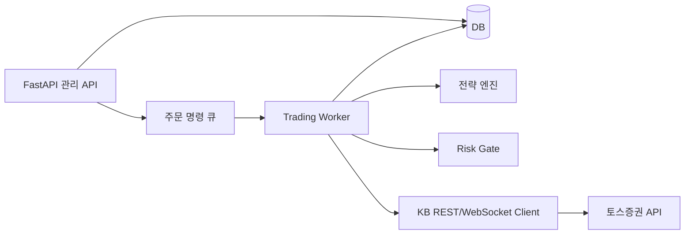

# 토스증권 주식 자동매매 시스템 PRD

## 1. 문서 개요

- 버전: 0.2 (요약본)
- 대상: 토스증권 Open API v1
- 구현 방향: Python + FastAPI, REST·WebSocket 연동
- 최초 운영: 가상금액(`PAPER`) 자동매매
- 실계좌 운영: 안정화 기준을 통과한 뒤 제한적으로 전환
- 문서: [토스증권 Open API](https://developers.tossinvest.com/docs)

이 시스템은 국내·미국 주식의 시세를 수집하고 전략 신호를 계산해 주문을 생성·추적한다. 실제 주문 API를 호출하기 전에 실제 시세를 이용한 가상매매로 전략과 시스템 안정성을 검증한다.

## 2. 목표

- 시세 수집부터 전략 실행, 주문, 체결, 잔고 동기화까지 자동화한다.
- 중복 주문, 호출 한도 초과, 토큰 만료, 네트워크 단절을 제어한다.
- 가상매매와 실매매가 동일한 전략·검증 로직을 사용하도록 한다.
- 모든 신호·주문·체결·오류를 추적 가능한 형태로 저장한다.

## 3. 범위

### 1차 범위

- OAuth 2.0 인증과 계좌 조회
- 국내·미국 주식 종목·현재가·호가·체결·1분봉·일봉 조회
- 보유 자산, 매수 가능 금액, 매도 가능 수량 조회
- 지정가·시장가 매수/매도, 주문 조회·정정·취소
- WebSocket 체결·호가·개인 주문 이벤트 수신
- Python + FastAPI 운영 API와 주문 워커
- `PAPER` 가상계좌 및 `LIVE` 실계좌 전환 제어

### 2차 범위

- `SINGLE`, `OCO`, `OTO` 조건주문
- 다중 전략·대시보드·알림·백테스트

### 제외

- 투자 조언·종목 추천
- 미수·신용·파생상품
- 계좌 개설·본인 인증 자동화
- 공식 문서에 없는 모의투자 서버의 가정

## 4. 실행 모드

| 모드 | 시세 | 주문 API | 계좌 상태 | 목적 |
|---|---|---|---|---|
| `PAPER` | 실제 시세 | 호출하지 않음 | 가상 잔고·체결 | 최초 운영과 안정화 |
| `SHADOW` | 실제 시세 | 호출하지 않음 | 예상 주문 기록 | 실시간 신호 비교 |
| `LIVE` | 실제 시세 | 실제 계좌 호출 | 실제 잔고·체결 | 승인된 제한적 실매매 |

- 실행 중 모드 변경은 금지하고 새 세션으로 전환한다.
- `PAPER`와 `LIVE`의 주문·잔고·손익 저장 영역을 분리한다.
- 모든 모드에서 손실 한도, 주문 금액·횟수 한도, 긴급 중지를 적용한다.

## 5. 사용자 흐름

1. 토스증권 WTS에서 API 클라이언트와 허용 IP를 설정한다.
2. 시스템이 토큰을 발급하고 `GET /api/v1/accounts`로 계좌를 확인한다.
3. 사용자가 종목, 전략, 가상 시작 자금, 주문 한도, 손실 한도를 설정한다.
4. 시스템이 시장 캘린더와 거래 가능 시간을 확인하며 시세를 수집한다.
5. 전략 신호가 발생하면 주문 전 검증 후 `PAPER`에서는 가상 체결, `LIVE`에서는 실제 주문을 수행한다.
6. 체결·잔고를 갱신하고, 연결 단절·재시작 후 REST 조회로 재동기화한다.

## 6. 핵심 기능 요구사항

### 인증·계좌

- `POST /oauth2/token`의 Client Credentials 방식으로 토큰을 발급한다.
- 토큰·client secret·계좌 식별자는 비밀 저장소에 보관하고 로그에서 마스킹한다.
- 계좌 API와 주문 API에는 `X-Tossinvest-Account: {accountSeq}`를 포함한다.
- 토큰 만료 시 동시 재발급을 막고 재발급 후 요청을 제한적으로 재시도한다.

### 시세·전략

- 종목 정보와 저변동 데이터는 캐시한다.
- 현재가 조회는 여러 심볼을 묶어 호출하고, 캔들은 `1m`·`1d` 페이지네이션을 지원한다.
- 실시간 전략은 `trade`·`orderbook` WebSocket을 우선 사용하고 REST로 초기화·보정한다.
- 전략은 `BUY`, `SELL`, `HOLD`와 근거, 목표 수량·가격을 반환한다.
- 휴장일·시장 세션·주문 가능 시간을 확인하지 못하면 신호를 실행하지 않는다.

### 주문·체결

- 주문은 `LIMIT`·`MARKET`, `BUY`·`SELL`을 지원한다.
- 주문 전 매수 가능 금액, 매도 가능 수량, 가격 단위, 상·하한, 포지션·손실 한도를 검증한다.
- 모든 주문에 고유 `clientOrderId`를 사용하고, 응답 유실 시 재전송 전에 주문 상태를 조회한다.
- 주문·부분 체결·완전 체결·취소·거절 상태를 저장한다.
- WebSocket 재연결 후 `OPEN`·`CLOSED` 주문과 잔고를 REST로 대조한다.

### 가상매매

- `PAPER`는 가상 시작 자금으로 잔고·보유 수량·주문·체결·손익을 계산한다.
- 지정가·시장가·부분 체결·미체결·수수료·세금·슬리피지를 규칙으로 명시한다.
- 체결 가격·시세 시각·체결 근거를 보존한다.
- 가상 손익은 전략 평가에 사용하며, 수익률만으로 실계좌 전환을 결정하지 않는다.

## 7. Python + FastAPI 구조

- FastAPI: 전략 설정, 주문 명령, 상태 조회, 헬스체크, 긴급 중지
- Worker: 토큰 갱신, 시세 수집, 전략 계산, 주문·체결 조회
- KB Client: `Authorization`·계좌 헤더, WebSocket, 재시도, 오류 변환
- Risk Gate: 주문 금액·수량·시간·중복·모드·손실 한도 검증
- DB: 주문·체결·잔고·전략·감사 로그의 기준 저장소
- HTTP 호출: `httpx.AsyncClient`; 금액·수량·가격: `Decimal`

주문 API 요청에서 긴 작업을 직접 수행하지 않고 명령을 큐에 넣은 뒤 워커가 처리한다. API와 워커는 실운영에서 별도 프로세스로 배포하며, 계좌별 주문 실행은 단일 writer로 제한한다.

## 8. 데이터 모델

- `Strategy`: 전략 ID, 종목, 조건, 실행 모드, 주문·포지션·손실 한도
- `OrderRecord`: `client_order_id`, `order_id`, 모드, 전략, 심볼, 방향, 수량, 가격, 상태, 체결 수량·가격, 오류
- `MarketEvent`: 심볼, 이벤트 유형, 가격, 수량, 시각, 데이터 출처
- `VirtualAccount`: 가상 시작 자금, 현금, 예약 금액, 보유 수량, 수수료·세금·슬리피지 정책
- `RiskSnapshot`: 현금, 포지션 금액, 실현·미실현 손익, 한도, 거래 가능 상태

## 9. 실계좌 전환 정책

### 안정화 기준

- 최소 20개 거래 세션 또는 4주 이상 `PAPER` 로그를 확보한다.
- 중복 주문 0건과 상태 불일치 원인 해결을 확인한다.
- 토큰 만료, `429`, 타임아웃, 재연결, 재동기화 테스트를 통과한다.
- 신호·주문·체결·잔고·손익 감사 로그 누락이 없어야 한다.
- 긴급 중지와 미체결 주문 확인 절차를 운영자가 수행한다.
- 실계좌 전환 전략 버전·설정·한도를 고정한다.

### 전환 절차

1. `PAPER` 전략·설정·오류·성과를 스냅샷한다.
2. 실제 계좌·잔고·주문 가능 금액·매도 가능 수량을 재확인한다.
3. `SHADOW` 또는 드라이런으로 주문 예정 결과를 비교한다.
4. 운영자가 계좌·전략·금액·손실 한도·모드를 승인한다.
5. 한 계좌·한 전략·소수 종목·최소 금액으로 `LIVE`를 시작한다.
6. 관찰 기간 동안 오류와 재동기화를 확인한 뒤 단계적으로 확대한다.

### 롤백

중복 주문, 예상하지 못한 주문, 상태 불일치, 연속 오류 또는 손실 한도 초과 시 신규 `LIVE` 주문을 차단한다. 기존 주문·체결 기록을 보존하고, 운영자 승인 후 미체결 주문을 처리한다.

## 10. 안정성·보안 요구사항

- API별 호출 제한을 중앙 큐와 캐시로 관리하고 `429`의 재시도 정보를 따른다.
- 모든 요청에 timeout, correlation ID, 구조화 로그를 적용한다.
- WebSocket 시세는 유실될 수 있으므로 최신 데이터와 REST 보정을 함께 사용한다.
- 주문 응답 유실 시 조회를 먼저 수행하고 단순 재전송을 금지한다.
- `/health/live`, `/health/ready`, API 호출량·지연·오류·워커 상태를 모니터링한다.
- 실주문 전환·긴급 중지·계좌 변경은 감사 로그에 남긴다.

## 11. 검증과 출시

### 테스트

- 전략·리스크·Decimal·멱등키 단위 테스트
- TR 요청·응답 fixture 계약 테스트
- 토큰 만료·권한 오류·429·타임아웃 테스트
- 가상 체결·부분 체결·재시작·재동기화 테스트
- 실주문 없이 시세부터 주문 상태까지 검증하는 드라이런

### 단계

1. **PAPER**: 시세·전략·가상 체결·로그·모니터링 검증
2. **SHADOW**: 실시간 신호와 예상 주문 비교
3. **LIVE 파일럿**: 제한된 계좌·종목·금액으로 실주문
4. **확장**: 조건주문, 다중 전략, 대시보드, 백테스트

## 12. 주요 미결정 사항

- 첫 전략과 대상 시장(국내·미국)
- 가상 체결 수수료·세금·슬리피지 기본값
- 저장소·배포 환경·알림 채널
- 공식 모의투자 환경 제공 여부
- API 이용 약관과 최신 호출 한도

## 참고 문서

- [토스증권 Open API 문서](https://developers.tossinvest.com/docs)
- [REST OpenAPI 원본](https://openapi.tossinvest.com/openapi-docs/latest/openapi.json)
- [WebSocket AsyncAPI 원본](https://openapi.tossinvest.com/openapi-docs/latest/asyncapi.json)

## 13. 2단계 구현 현황 (v0.2)

- `/dashboard` 운영 화면에서 가상계좌, 포지션, 주문, 전략, 최근 시세를 확인한다.
- 이동평균 전략을 여러 개 등록하고 PAPER 엔진에서 실행한다.
- `POST /api/v1/market/sync`가 토스 `GET /api/v1/prices`를 읽기 전용으로 호출해 PAPER 틱으로 반영한다.
- 토큰과 API 오류를 공통 오류 응답으로 변환하고, 토스 주문 API는 호출하지 않는다.
- 다음 작업은 WebSocket 시세 스트림, 조건주문(SINGLE/OCO/OTO), 알림과 백테스트다.
